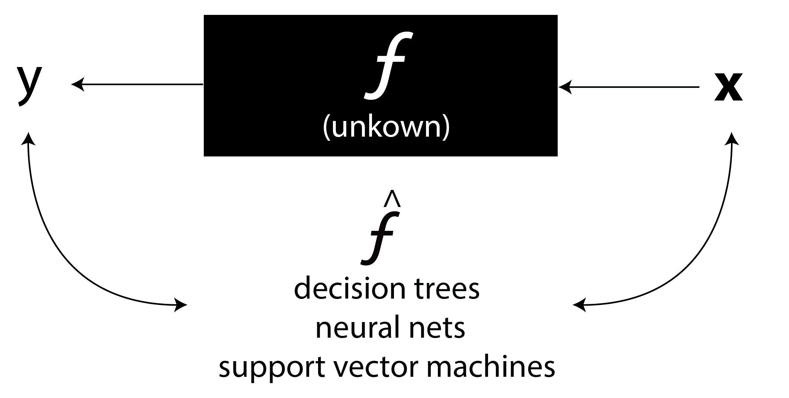
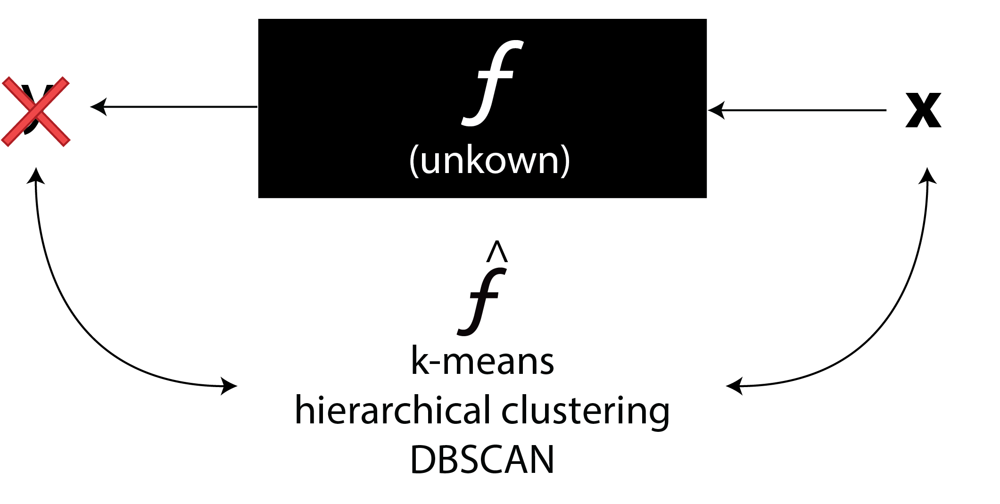
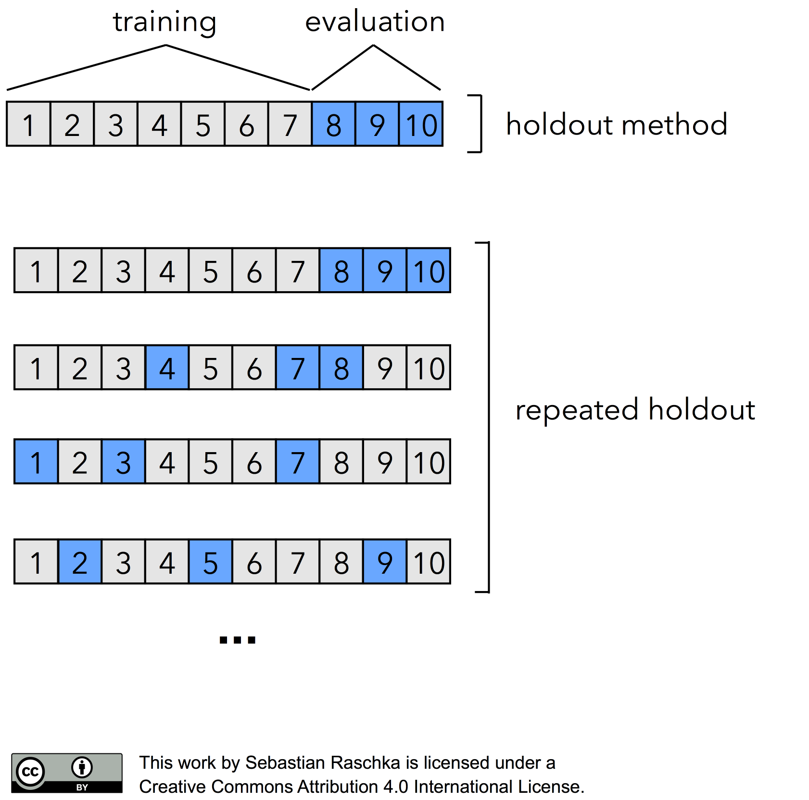
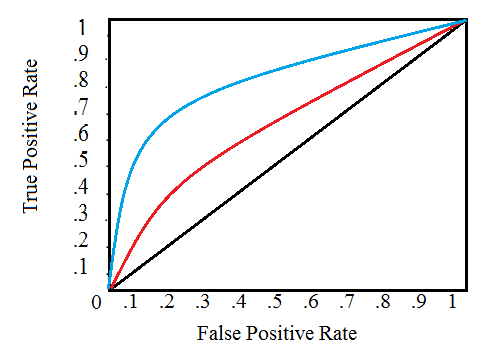
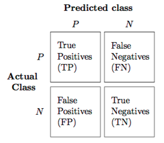
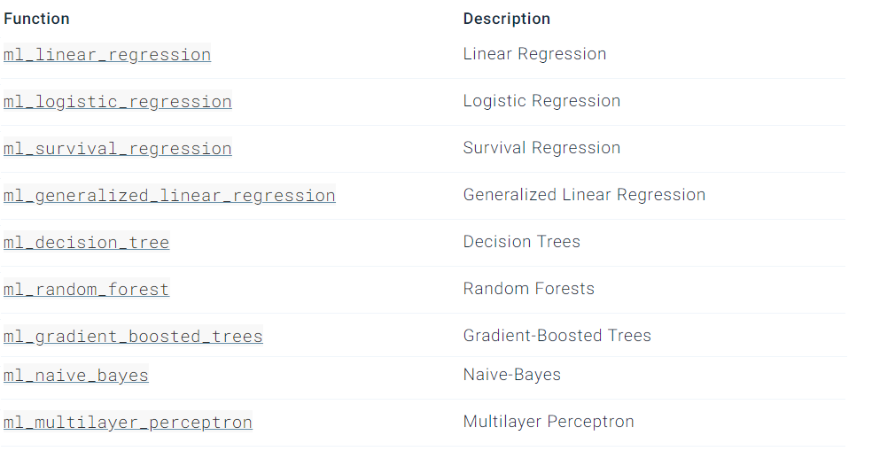
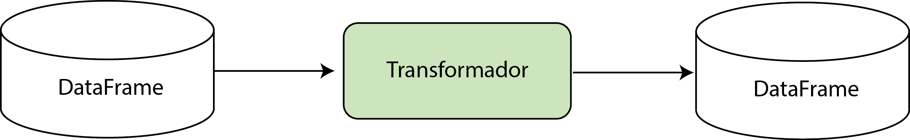
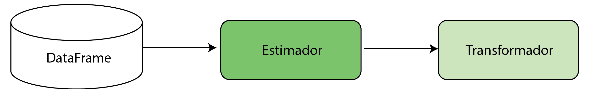

```{r setup, include=FALSE,message=FALSE}
options(htmltools.dir.version = FALSE,warn = FALSE,warning=FALSE)
options("getSymbols.warning4.0"=FALSE)
Sys.setenv(TZ = "GMT")
library(sparklyr)
library(tidyverse)

```

# Aprendizado Estatístico de Máquina Supervisionado

<br/>
<br/>
.center[]

---
# Aprendizado Estatístico de Máquina Não Supervisionado

<br/>
<br/>
.center[]

---
class: inverse, center, middle
# Como fazer a estimação dos modelos de maneira distribuída?
---
background-image: url(https://miro.medium.com/max/2800/1*b7VXivcK-wBqQJDWjzBszg.png)
background-size: 200px
background-position: 90% 8%

#Spark Machine Learning Library

- Biblioteca que contém modelos estatísticos, supervisionados e não supervisionados implementados de maneira distrbuída

- Possui um também um *framework* para *feature engineering*.

- Trabalha com o paradigma de **Transformers** e **Estimators**

- Extensões: **H2O**, **XGB**,...


---
background-image: url(https://media.giphy.com/media/26FfhYBnzPt2PVqI8/giphy.gif)
background-size: cover
class: center, middle, inverse

#Será que conseguimos gerar um modelo para prever a eleição de candidatos?

---
#Importando a base de dados

- Link:

```{r warning=FALSE}
library(sparklyr)
sc<-spark_connect(master = 'local',version = '2.3')

database<-spark_read_csv(sc,path="D:/my_computer/Est_ML_2019/sparklyr_led_day/database_modulo2_final.csv",
                                        memory = FALSE,
                                        charset = 'latin1',
                                        delimiter = ",")


```

---
#Analisando a base

Vamos analisar as covariáveis presentes na base de dados em questão
```{r}
#Analisando uma "prévia" da base de dados
glimpse(database)
```

---
#Limpeza dos dados

- Vamos inicialmente considerar apenas os candidatos **vereadores**, e criar um classificador em que a variável resposta seja se este foi eleito ou não. Analisando a covariável "DS_SIT_TOT_TURNO"

```{r warning=FALSE}  
database %>% select(DS_SIT_TOT_TURNO) %>% distinct() # Distinct seleciona os valores únicos da coluna
```

- Selecionaremos da seguinte maneira:
  - 1 (Eleitos): "ELEITO","ELEITO POR MÉDIA", "ELEITO POR QP"
  - 0 (Não eleito): "NÃO ELEITO"

Os demais candidatos serão filtrados


---
#Limpeza dos dados

Após a primeira análise das covariáveis relevantes, e dos filtros necessários, 
vamos pré-processar a base e selecionar as covariáveis
```{r}
clean_database<-database %>% 
                filter(DS_CARGO=="VEREADOR" & DS_SIT_TOT_TURNO!="#NULO#"
                       & DS_SIT_TOT_TURNO!="SUPLENTE") %>% #Filtra os vereadores, excluindo os nulos e o Supl.
                mutate(DS_SIT_TOT_TURNO=ifelse(DS_SIT_TOT_TURNO!="NÃO ELEITO",1,0)) %>% #Transforma a var. resp
                select(DS_GENERO,TP_AGREMIACAO,SG_PARTIDO,DS_NACIONALIDADE,NR_IDADE_DATA_POSSE,DS_GRAU_INSTRUCAO,DS_COR_RACA,DS_SIT_TOT_TURNO,ST_REELEICAO,bens_total,n_bens) #Seleciona as variáveis que serão utilizadas.

glimpse(clean_database)
```

---
class: inverse, center, middle
# Aprendizado Supervisionado
---
# Aprendizado Supervisionado

- Suponha ${\displaystyle X}$ como o espaço vetorial de todas possíveis observações.

- sonha ${\displaystyle Y}$ como sendo o espaço vetorial de todas variáveis respostas possíveis.

- Dado o espaço de todas funções ${\mathcal {H}}$ em que $f:X\to Y$

### O principal objetivo é estimar uma função $\hat{f}$, a partir de ${\vec  {x}} \in {\displaystyle X}$, e $y \in {\displaystyle Y}$, em que $\hat{f}({\vec  {x}})\sim y$.

---
#Aplicação: Holdout

.center[]

---
# Framework Convencional
```{r }
#Data Splitting
data_splits<-sdf_random_split(clean_database,training=0.8,testing=0.2,seed=42)
train_data<-data_splits$training
test_data<-data_splits$testing
```

```{r}
#Training and evaluating
logistic_model<-train_data %>% ml_logistic_regression(DS_SIT_TOT_TURNO~.) #Ajustando regressão logística
validation_v<-ml_evaluate(logistic_model,test_data) #A funcao ml_evaluate calcula metricas para avaliar a perf.
predictions<-ml_predict(dataset = test_data,x = logistic_model) #Armazena os valores preditos p/ amost. teste

#Métricas de validação
#ml_evaluate apresenta diversas metricas de validacao dentro elas a curva roc
validation_v$area_under_roc()
```
---
#Curva ROC
.pull-left[
<br/>
<br/>
.center[]
]
.pull-right[
.center[

$$TPR=\frac{TP}{TP+FN}$$
$$FPR=\frac{FP}{FP+TN}$$
]]

---
#Plotando a curva ROC

```{r out.height=350,out.width=350}
#Colletando todos valores da coordenada da curva roc considerando todos
#os threshold,
roc <- validation_v$roc() %>%
  collect() #Coleta esses valores para o ambiente R

ggplot(roc, aes(x = FPR, y = TPR)) + #Dá as coordenadas de cada uma das taxa
  geom_line() + geom_abline(lty = "dashed")+ggtitle("Curva ROC")+theme_bw()
```
---
#Outros Modelos

- ml_(*)

.center[]
---
class: inverse, center, middle

# Aprendizado Não-Supervisionado
---
# Aprendizado não supervisionado

.center[]
---
#PCA

.center[]

```{r}
#Unsupervised Machine Learning
unsupervised_data<-copy_to(sc,iris)

#Encontra as componentes principais
pca_model<-ml_pca(unsupervised_data,features = c("Sepal_Length","Sepal_Width","Petal_Length","Petal_Width"))

#Projeta as observações nessas componentes principais
pca_data<-sdf_project(newdata =  unsupervised_data,object = pca_model)
rotated_data<-pca_data %>% select(PC1,PC2,Species) %>% collect
```
---
# PCA
Plotando o resultado do PCA, temos as observações da base de dados Iris projetadas nas duas componentes principais como sendo:
```{r out.height=350,out.width=350}
ggplot(rotated_data)+
  geom_point(mapping = aes(x=PC1,y=PC2))+ggtitle("Análise PCA (Iris Data)")+theme_bw()
```

---
#Clusterização (K-Means)
.center[]
---
#Clusterização (K-Means)

Uma vez projetada as observações do Iris sobre as duas componentes principais, iremos utilizar estas como base dados para modelar a clusterização utilizando o método k-means

```{r }
kmeans<-pca_data %>% select(PC1,PC2,Species) %>% #utilizando as base de dados resultado da PCA (PC1,PC2)
        ml_kmeans(formula = Species~.,k=3)#     Definindo argumentos da clusterização (k centróides)

cluster_pred<-ml_predict(kmeans,
                         dataset = select(pca_data,PC1,PC2,Species))#Defindo os rótulos

centers<-kmeans$centers %>% collect()#Trazendo os centróides para ambiente R

resultado_clusterizacao_plot<-cluster_pred %>% 
      select(PC1,PC2,prediction) %>%
      collect #Coletando result. clus.

#Transformando em Fator
resultado_clusterizacao_plot$prediction<-as.factor(resultado_clusterizacao_plot$prediction)
f<-as.factor(c(0,1,2))

```
---
#Clusterização (K-Means)

Plotando o resultado da PCA+K-Means temos:

```{r out.height=400,out.width=400}
ggplot(resultado_clusterizacao_plot)+
  geom_point(mapping = aes(x=PC1,y=PC2,col=prediction))+ggtitle("K-Means (Iris Data)")+theme_bw()+
  geom_point(data = centers,mapping = aes(x=PC1,y=PC2,col=f),size=5,pch=4,stroke=2)

```


---
class: inverse, center, middle

# Como otimizar este *workflow*?
---
background-image: url(pipeline.jpg)
background-size: cover
class: center, middle, inverse

# Pipeline

---
#Pipeline

- O conceito de *pipeline* indica um conjunto de elementos de processamentos de dados que estão diretamentes conectados.

- Para o pipeline do Sparklyr temos os seguintes elementos que o compõe:
  - DataFrame
  - Transformador
  - Estimatador
  - Parâmetros
  
- Para colocar um modelo em produção a utilização de um pipeline é fortemente recomendável

---
#Transformador

.center[.big["Um **Transformador** pode ser utilizado para aplicar transformações sobre um **DataFrame**, retornando outro" ]]

.center[]

### Exemplos:
- One-Hot-Enconding ("Dummyficação")
- Predict

---
#Estimadores

.center[.big["Tecnicamente, um **Estimador** treina um modelo a partir de um **DataFrame**, sendo este modelo um **Transformador**"]]

.center[]

### Exemplos:
- ml_logistic_regression()
---
#Exemplo: Transformadores

Aqui utilizaremos o primeiro exemplo do que pode vir a ser um transformador. 
O **ft_string_indexer()** transforma variáveis categóricas em variáveis númericas, como pode-se ver abaixo
```{r}
  ft_string_indexer(train_data,input_col = "DS_GENERO",output_col = "index_DS_GENERO") %>%
  select(index_DS_GENERO) %>% 
  distinct
```
---
#Exemplo: Estimadores

Para o caso de estimadores existe a função **ft_standard_scaler**, inicialmente propõe-se o "esqueleto" indicando o input, e output desse estimador, além de outros argumentos no sentido de padronizar um conjunto de covariáveis
```{r}
scaler<-ft_standard_scaler(sc,
                   input_col = 'assembler_NR_IDADE_DATA_POSSE',
                   output_col = 'scaled_idade',
                   with_mean = TRUE)
scaler  
```
---
#Exemplo: Estimadores

- Após criado o "esqueleto" este é ajustado com base no dataset **clean_database** através da função ml_fit()

- A função **ft_vector_assembler()** é um transformador e modifica a estrutura de uma base de dados de modo que ela se transforme em uma lista de valores númericos. Esta ferramenta otimiza e  facilita a utlização em diversos modelos utilizados.
```{r}
df<-clean_database %>% 
ft_vector_assembler(input_cols = "NR_IDADE_DATA_POSSE",
                    output_col="assembler_NR_IDADE_DATA_POSSE")  
model_scaler<-ml_fit(scaler,dataset = df)
model_scaler
```

---
#Exemplo: Estimadores

- Por fim, o transformador **ml_transform()** gerado pelo estimador é utilizado  criando a covariável padronizada
```{r}
model_scaler %>% 
  ml_transform(df) %>% #Aplica o transformador
                       #gerado pelo estimador ft_standard_scaler()
  glimpse

```
---
#Previsão eleitoral: Pipeline
A utilização conjunta de estimadores e transformadores gera o **Pipeline**
```{r}
pipeline_eleitoral<-ml_pipeline(sc) %>% 
  ft_string_indexer(input_col = "DS_GENERO",output_col="gen_index") %>% 
  ft_string_indexer(input_col = "TP_AGREMIACAO",output_col="agr_index") %>% 
  ft_string_indexer(input_col = "SG_PARTIDO",output_col="par_index") %>% 
  ft_string_indexer(input_col = "DS_NACIONALIDADE",output_col="nac_index") %>% 
  ft_string_indexer(input_col = "DS_GRAU_INSTRUCAO",output_col="int_index") %>% 
  ft_string_indexer(input_col = "DS_COR_RACA",output_col="rac_index") %>% 
  ft_string_indexer(input_col = "ST_REELEICAO",output_col="rel_index") %>% 
  ft_one_hot_encoder_estimator(input_cols = c("gen_index","agr_index","par_index",
                                   'nac_index','int_index',"rac_index",
                                   'rel_index'),  
                     output_cols=c("gen_encoded","agr_encoded","par_encoded",
                                   'nac_encoded','int_encoded',"rac_encoded",
                                   'rel_encoded')) %>% 
  ft_vector_assembler(
    input_cols = c("NR_IDADE_DATA_POSSE",'bens_total','n_bens',
                   "gen_encoded","agr_encoded","par_encoded",
                    'nac_encoded','int_encoded',"rac_encoded",
                                   'rel_encoded'),
    output_col = 'features'
  ) %>% 
  ft_standard_scaler(input_col = 'features',output_col='features_scaled',with_mean=TRUE) %>% 
  ml_random_forest_classifier(features_col = 'features_scaled',
                         label_col='DS_SIT_TOT_TURNO')
```

---
#Previsão eleitoral: Pipeline

.pull-left[
 - O pipeline anterior utiliza em conjunto transformadores e estimadores
 - Inicialmente os transformadores ft_string_indexer() e one_hot_enconder() funcionam como um pré-processamento das variáveis categóricas.
 - ft_vector_assembler() combina todas as observaçoes em um "single row-vector"
 - Enfim, os transformadores ft_standard_scaler() e ml_random_forest_classfier() são os estimadores, sendo este último responsável pela modelagem
]

.pull-right[
<br/>
<br/>
<br/>

]
---
#Predizendo as observações

Com o **Pipeline** predizer o modelo se torna uma  tarefa mais simples
```{r}
#Ajustando o modelo com base na base de treinamento, utilizando a pipeline
pipe_model<-ml_fit(pipeline_eleitoral,dataset = train_data)

#Obtendo o resultado da base transformada com as predições novas
resultado2<-ml_transform(dataset = test_data,x = pipe_model)

#Selecionando as prediçoes
pred<-resultado2 %>% select(prediction) %>% collect %>% unlist
#Selecionando os valores observados
observed<-resultado2 %>% select(DS_SIT_TOT_TURNO) %>% collect %>% unlist

#Criando a matriz de confusão para calcular a acurácia
acc<-sum(diag(table(pred,observed)))/(sum(table(pred,observed)))
acc

```

---
#Tuning
.center[]
---
#Tuning
```{r}
cv <- ml_cross_validator(
  sc,#Indica a conexão do sparklyr
  estimator = pipeline_eleitoral, #O estimador será o pipeline já construido
  estimator_param_maps = list(
    random_forest=list( #Indica qual método que será testado
    num_trees = c(5,10,50,100), #Possíveis valores de n_tres
    impurity = c("entropy", "gini")#Possiveis valores de entropia
    )
  ),
  evaluator = ml_binary_classification_evaluator(sc,label_col = "DS_SIT_TOT_TURNO",raw_prediction_col = "prediction"), #Que métrica de validação será utilizada
  num_folds = 5, #Numero de folds para validação
  parallelism = 4) #Parelizando o processo

cv
```

---

#Tuning

```{r}
#Ajustando o modelo considerando a base de treinamento
cv_model <- ml_fit(cv, train_data)
#Vendo o resultado de cada configuração dos hiperparâmetros
ml_validation_metrics(cv_model)
```
##Saving the model

```{r}
model_directory <- file.path("spark_model")
ml_save(cv_model$best_model, model_directory, overwrite = TRUE)
```
---
#Convertendo nossa base em Parquet
- Podemos utilizar a estrutura de pipeline para transformar a nossa base de dados, em um formato totalmente número e posteriormente salvá-la no formato Parquet.
- **Parquet** é um um formato de arquivo eficiente, ideal para dados numéricos.

```{r}
pipeline_parquet<-ml_pipeline(sc) %>% 
  ft_string_indexer(input_col = "DS_GENERO",output_col="gen_index") %>% 
  ft_string_indexer(input_col = "TP_AGREMIACAO",output_col="agr_index") %>% 
  ft_string_indexer(input_col = "SG_PARTIDO",output_col="par_index") %>% 
  ft_string_indexer(input_col = "DS_NACIONALIDADE",output_col="nac_index") %>% 
  ft_string_indexer(input_col = "DS_GRAU_INSTRUCAO",output_col="int_index") %>% 
  ft_string_indexer(input_col = "DS_COR_RACA",output_col="rac_index") %>% 
  ft_string_indexer(input_col = "ST_REELEICAO",output_col="rel_index") %>% 
  ft_one_hot_encoder_estimator(input_cols = c("gen_index","agr_index","par_index",
                                   'nac_index','int_index',"rac_index",
                                   'rel_index'),  
                     output_cols=c("gen_encoded","agr_encoded","par_encoded",
                                   'nac_encoded','int_encoded',"rac_encoded",
                                   'rel_encoded')) 
```

---
#Convertendo nossa base em Parquet

Ajustando e transformando a base de dados, e selecionando o resultado do pré-processamento temos
```{r eval=FALSE}
base_parquet<-ml_fit_and_transform(pipeline_parquet,dataset = clean_database) %>%
      select(NR_IDADE_DATA_POSSE,bens_total,n_bens,gen_encoded,agr_encoded,par_encoded,
                                   nac_encoded,int_encoded,rac_encoded,
                                   rel_encoded)

#Para salvar em parquet, basta:
spark_write_parquet(base_parquet, "data/clean_database.parquet")


#Para ler a base salva, basta simplesmente
nova_base_parquet<-spark_read_parquet(sc,path = "data/clean_database.parquet")

```
---
class: title-slide-final, middle
background-image: url(logo.png)
background-size: 150px
background-position: 9% 15%

# Perguntas?
# Obrigado pela atenção

.pull-down[

<a href="mailto:mateusmaia11@gmail.com">
.white[`r icon::fa("paper-plane")`mateusmaia11@gmail.com]
</a>
      
<a href="https://twitter.com/MateusMaiaM">
.white[`r icon::fa("twitter")` @MateusMaiaM]
</a>

<a href="https://github.com/MateusMaiaDS">
.white[`r icon::fa("github")` @MateusMaiaDS]
</a>

<a href="http://www.led.ufba.br/">
.white[`r icon::fa("exclamation")` LED - Laboratório de Estatística e Datascience]
</a>

<a href="http://ime.ufba.br/">
.white[`r icon::fa("graduation-cap")` Instituto de Matemática e Estatística - UFBA]
</a>

<br><br><br>

]

